# SyncFlow User Guide
## Complete Guide for Android, macOS, and Web Apps

**Version:** 1.0
**Last Updated:** January 2025

---

> **Note:** Screenshots are located in the `docs/screenshots/` folder.
> To add screenshots, place images in that folder and they will display below.

---

## Table of Contents

1. [Introduction](#introduction)
2. [Getting Started](#getting-started)
3. [Device Pairing](#device-pairing)
4. [Android App](#android-app)
5. [macOS App](#macos-app)
6. [Web App](#web-app)
7. [Messaging Features](#messaging-features)
8. [Calling Features](#calling-features)
9. [Contacts Management](#contacts-management)
10. [AI Assistant](#ai-assistant)
11. [Privacy & Security](#privacy--security)
12. [Settings & Customization](#settings--customization)
13. [Troubleshooting](#troubleshooting)

---

## Introduction

SyncFlow is a comprehensive communication platform that syncs your phone's SMS, MMS, calls, and contacts across all your devices. Send and receive messages from your Mac or web browser, make calls, and keep everything in sync.

### Key Features
- **Message Sync** - View and send SMS/MMS from any device
- **Call Management** - See call history, make calls via WebRTC
- **Contact Sync** - Two-way sync between phone and desktop
- **AI Assistant** - Analyze spending, find OTPs, smart insights
- **End-to-End Encryption** - Secure message sync
- **Voice Messages** - Record and send audio messages

*SyncFlow running on Android, macOS, and Web*

---

## Getting Started

### System Requirements

#### Android
- Android 8.0 (API 26) or higher
- SMS permissions
- Internet connection

#### macOS
- macOS 11.0 (Big Sur) or higher
- Internet connection

#### Web
- Modern browser (Chrome, Firefox, Safari, Edge)
- Internet connection

### Installation

#### Android
1. Install SyncFlow from the Play Store (or sideload APK)
2. Open the app and grant required permissions:
   - SMS (Read, Send, Receive)
   - Contacts
   - Phone
   - Notifications
3. Set SyncFlow as your default SMS app (required for sending)

#### macOS
1. Download SyncFlow from the releases
2. Drag to Applications folder
3. Open and allow notifications when prompted

#### Web
1. Navigate to the SyncFlow web app URL
2. No installation required

---

## Device Pairing

Pairing connects your Android phone to your Mac or web browser.

### Method 1: QR Code (Recommended)

#### On Android:
1. Open SyncFlow
2. Tap **Desktop Integration** in the bottom navigation
3. Your pairing QR code is displayed

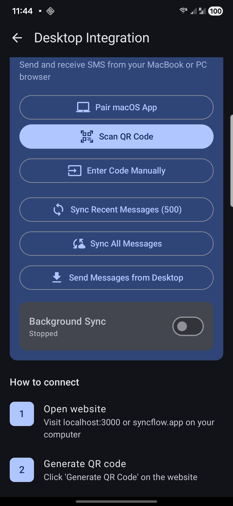
*Android showing pairing QR code*

#### On macOS:
1. Open SyncFlow
2. Click **Scan QR Code**
3. Point your Mac's camera at the phone's QR code
4. Wait for "Paired Successfully" message

*macOS pairing screen with QR scanner*

#### On Web:
1. Open the web app
2. Click **Scan QR Code**
3. Allow camera access
4. Scan the QR code from your phone

### Method 2: Manual Code

If QR scanning doesn't work:

1. On Android: Note the pairing code shown below the QR
2. On Mac/Web: Click **Enter Code Manually**
3. Type the code and click **Pair**

### Verifying Connection

Once paired:
- Android shows "Connected devices: 1"
- macOS/Web shows your phone model
- Messages begin syncing automatically

---

## Android App

### Home Screen

The main screen shows your conversations sorted by recent activity.

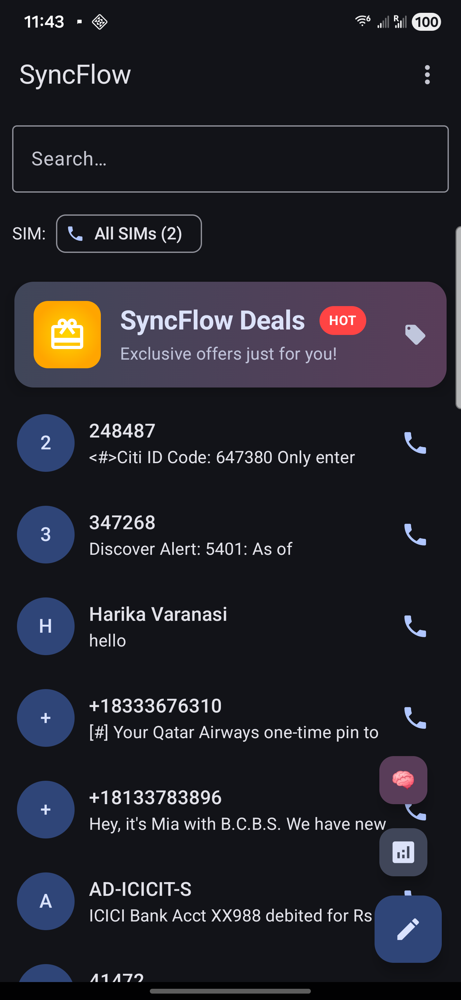
*Android conversation list with pinned chats*

#### Conversation List
- **Tap** a conversation to open it
- **Long press** for quick actions (pin, mute, archive, delete)
- **Swipe left** to archive
- **Swipe right** to delete

#### Pinned Conversations
- Pinned conversations appear at the top
- Long press → Pin to pin a conversation
- Pinned status syncs across refreshes

#### Ads/Deals Card
- The top card shows curated deals
- Tap to view current offers

*Deals and offers screen*

### Bottom Navigation

| Icon | Section | Description |
|------|---------|-------------|
| Messages | Conversations | Your SMS/MMS conversations |
| Contacts | Contacts | Phone contacts with quick actions |
| Deals | Deals | Shopping deals and offers |
| AI | AI Assistant | Smart message analysis |
| More | Settings | App settings and preferences |

### Sending Messages

1. Open a conversation or tap **+** for new message
2. Type your message
3. Tap **Send** (arrow icon)

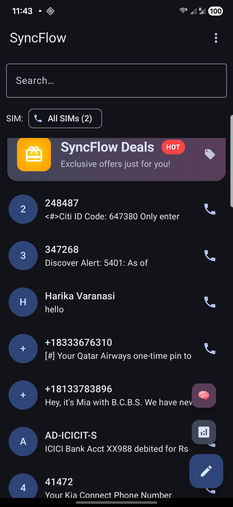
*Message thread with sent and received messages*

#### Attachments
- Tap the **📎** icon to attach:
  - Photos from gallery
  - Camera capture
  - Files
  - Voice recording (hold microphone icon)

#### Voice Messages
1. Tap and hold the **🎤** microphone icon
2. Speak your message
3. Release to send, or slide left to cancel

### Message Features

#### Reactions
- Long press any message
- Select an emoji reaction
- Reactions sync to desktop

#### Reply
- Long press → Reply
- Type your response

#### Forward
- Long press → Forward
- Select recipient(s)

#### Star Messages
- Long press → Star
- Find starred messages in Settings → Starred Messages

#### Copy/Delete
- Long press → Copy or Delete

### Scheduled Messages

Send messages at a specific time:

1. Compose your message
2. Long press the Send button
3. Select date and time
4. Tap **Schedule**

View scheduled messages: Settings → Scheduled Messages

### Smart Replies

Quick reply suggestions appear above the keyboard based on message context.

---

## macOS App

### Main Window

The app has a three-panel layout:

| Panel | Content |
|-------|---------|
| Left Sidebar | Conversation list with search |
| Center | Message thread |
| Right (optional) | Contact details |

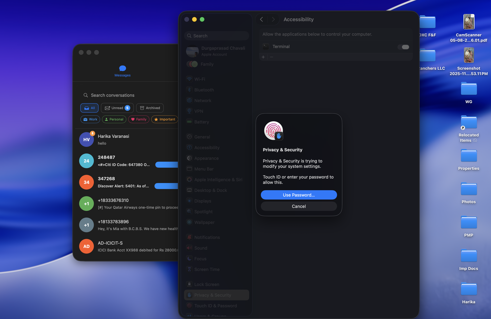
*macOS main window with conversation list*

### Menu Bar Icon

SyncFlow lives in your menu bar for quick access:

- Click icon to show/hide main window
- Shows unread count badge
- Right-click for quick actions

### Keyboard Shortcuts

| Shortcut | Action |
|----------|--------|
| ⌘ + N | New message |
| ⌘ + F | Search messages |
| ⌘ + , | Open settings |
| ⌘ + 1 | Messages tab |
| ⌘ + 2 | Contacts tab |
| ⌘ + 3 | Call History tab |
| ⌘ + Enter | Send message |
| ⌘ + Shift + A | Archive conversation |
| Esc | Close current panel |

### Sending Messages

1. Select a conversation or click **+** for new
2. Type in the message field at bottom
3. Press **⌘ + Enter** or click Send

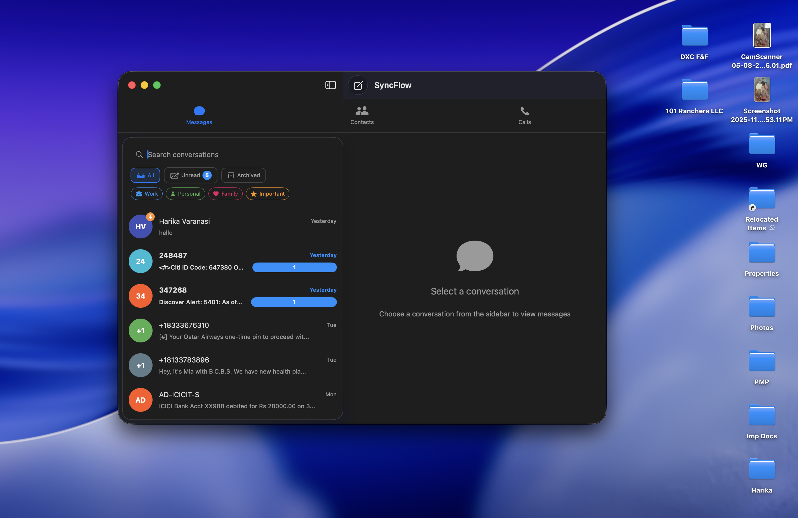
*Message thread on macOS*

#### Attachments
- Drag and drop files into the message area
- Click **📎** to browse files
- Supports images, videos, audio, documents

#### Voice Messages
1. Click the **🎤** microphone icon
2. Click again to start recording
3. Click **Stop** when done
4. Click **Send** to send the recording

### Call Features

#### View Call History
1. Click **Call History** tab
2. See incoming, outgoing, and missed calls
3. Click a contact to call back

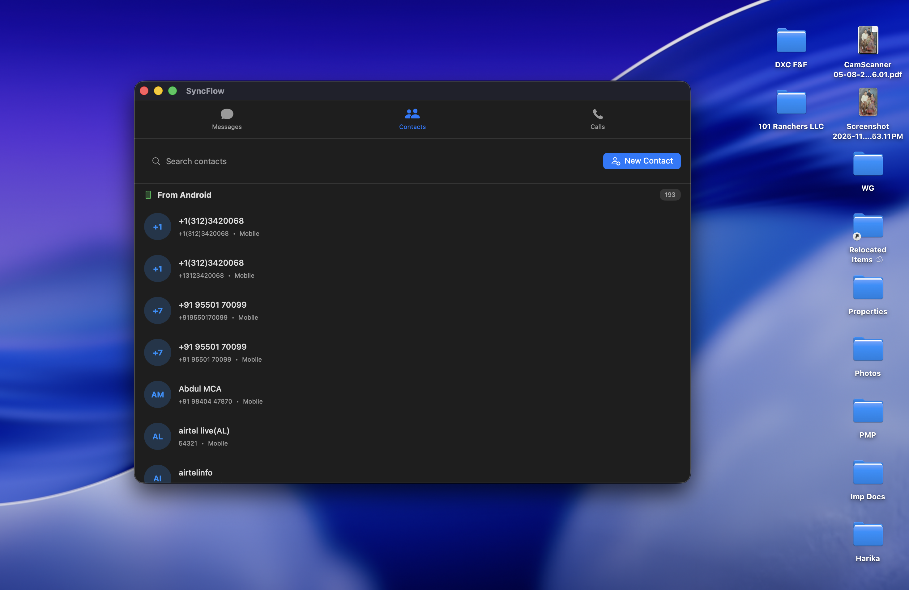
*Call history showing recent calls*

#### Make a Call (SyncFlow-to-SyncFlow)
1. Click **Dialer** tab
2. Enter number or select contact
3. Click **Call**
4. Uses WebRTC for audio/video

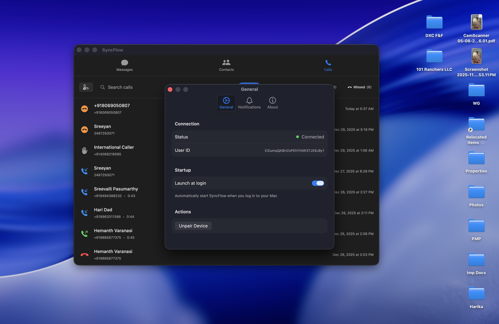
*Dialer for making calls*

#### During a Call
- **Mute** - Toggle microphone
- **Speaker** - Toggle speaker
- **Video** - Toggle camera (video calls)
- **End** - Hang up

### Notifications

Desktop notifications appear for:
- New messages
- Incoming calls
- Missed calls

#### Quick Reply
- Click the notification
- Or use the reply field in the notification (macOS 12+)

### Settings

Access via **⌘ + ,** or menu bar → Settings:

- **General** - Startup options, theme
- **Notifications** - Sound, badges, alerts
- **Privacy** - Blocked contacts, encryption
- **Shortcuts** - Customize keyboard shortcuts
- **About** - Version info, pairing status

---

## Web App

### Accessing the Web App

1. Open your browser
2. Navigate to the SyncFlow web URL
3. If not paired, you'll see the pairing screen

### Interface

The web app mirrors the macOS experience:

- **Left panel** - Conversation list
- **Center panel** - Message thread
- **Top bar** - Navigation (Messages, Contacts)

### Features

| Feature | How to Use |
|---------|------------|
| View Messages | Click any conversation |
| Send Message | Type and click Send |
| New Conversation | Click + and select contact |
| Search | Use search bar at top |
| View Contacts | Click Contacts in nav |
| AI Assistant | Click AI icon in message view |

### Contacts Page

1. Click **Contacts** in the navigation
2. Browse or search contacts
3. Click a contact to:
   - Start a message
   - View details
   - Call (if supported)

### Limitations

The web app has some limitations compared to native apps:
- No push notifications (requires browser to be open)
- No offline access
- Voice recording requires microphone permission

---

## Messaging Features

### Message Types

| Type | Description |
|------|-------------|
| SMS | Standard text messages |
| MMS | Messages with attachments (images, video, audio) |
| Voice | Audio recordings |

### Message Status Indicators

| Indicator | Meaning |
|-----------|---------|
| ✓ | Sent |
| ✓✓ | Delivered |
| Clock | Sending/Scheduled |
| ❌ | Failed |

### Message Categories

SyncFlow automatically categorizes messages:

- **OTP** - One-time passwords (easy copy button)
- **Transactions** - Banking/payment notifications
- **Promotions** - Marketing messages
- **Personal** - Regular conversations

### Conversation Actions

| Action | How | Description |
|--------|-----|-------------|
| Pin | Long press → Pin | Keep at top of list |
| Mute | Long press → Mute | Silence notifications |
| Archive | Swipe left / Long press | Hide from main list |
| Block | Long press → Block | Block sender |
| Delete | Swipe right / Long press | Remove conversation |

### Search

Search across all messages:

1. Tap/click the search icon
2. Enter search terms
3. Results show matching messages
4. Tap a result to jump to that conversation

---

## Calling Features

### Call History

All platforms show your call history:
- **Incoming** calls (with/without answer)
- **Outgoing** calls
- **Missed** calls
- Call duration
- Time/date

### SyncFlow-to-SyncFlow Calls

Make free audio/video calls to other SyncFlow users:

1. Both users must have SyncFlow installed
2. Both must be signed in
3. Initiate call from Dialer or contact card
4. Uses WebRTC (internet-based)

### Call Controls

During an active call:

| Control | Function |
|---------|----------|
| Mute | Mute your microphone |
| Speaker | Toggle speakerphone |
| Video | Toggle camera on/off |
| Flip | Switch front/back camera |
| End | Hang up |

### Incoming Calls

When receiving a SyncFlow call:
- Notification appears on all paired devices
- Answer from any device
- Decline or send to voicemail

---

## Contacts Management

### Viewing Contacts

- **Android**: Bottom nav → Contacts
- **macOS**: Sidebar → Contacts tab
- **Web**: Top nav → Contacts

*Android contacts list*

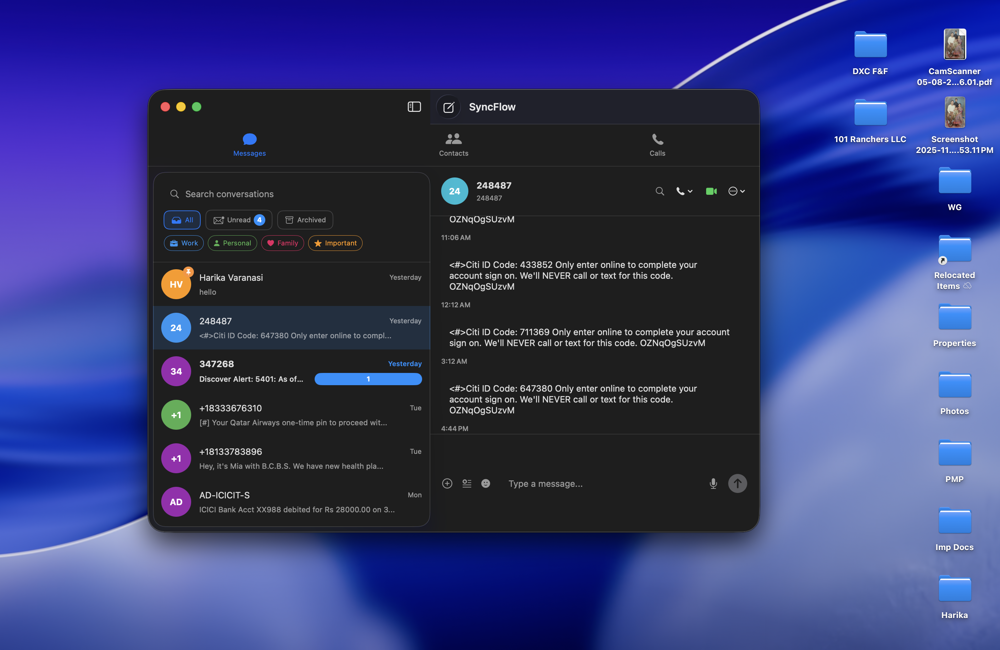
*macOS contacts view*

### Contact Features

| Feature | Description |
|---------|-------------|
| Search | Find contacts by name or number |
| Favorites | Star important contacts |
| Groups | Organize contacts into groups |
| Photos | Contact photos sync across devices |

### Two-Way Sync

Contacts sync in both directions:

1. **Android → Desktop**: Phone contacts appear on Mac/Web
2. **Desktop → Android**: Contacts created on Mac/Web sync to phone

### Creating Contacts

#### On Android:
1. Contacts → **+** button
2. Fill in details
3. Save

#### On macOS/Web:
1. Contacts → **New Contact**
2. Enter name, number, email
3. Contact syncs to Android automatically

### Blocking Contacts

Block unwanted senders:

1. Open conversation or contact
2. Long press → Block
3. Blocked contacts can't message you
4. Manage blocks in Settings → Blocked Contacts

---

## AI Assistant

The AI Assistant analyzes your messages locally (on-device) to provide insights.

### Accessing AI Assistant

- **Android**: Bottom nav → AI
- **macOS**: Click AI icon in toolbar
- **Web**: Click AI button in message view

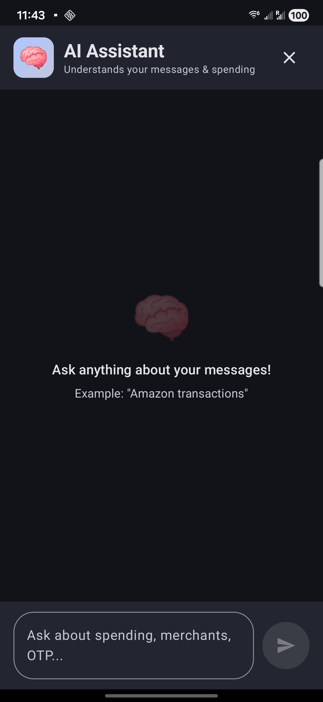
*AI Assistant analyzing messages*

### Features

#### Spending Analysis
Ask questions like:
- "How much did I spend this month?"
- "What are my Amazon transactions?"
- "Show my Uber spending this week"

The AI:
- Extracts amounts from transaction messages
- Filters by merchant when specified
- Excludes refunds and credits
- Shows totals and individual transactions

#### OTP Finder
- "Find my OTPs"
- "What's my latest verification code?"
- Shows recent one-time passwords

#### Message Search
- "Find messages about flight booking"
- "Show messages from last week"

### Tips for Better Results

1. Be specific: "Amazon spending" vs just "spending"
2. Specify time: "this month", "last week", "today"
3. The AI only analyzes YOUR messages, nothing leaves your device

---

## Privacy & Security

### End-to-End Encryption

Messages synced between devices are encrypted:
- Uses Signal Protocol
- Keys stored securely on each device
- Messages encrypted before upload to Firebase
- Only your devices can decrypt

### Encryption Indicators

- 🔒 Lock icon = Message is encrypted
- Messages show "Encrypted" badge when E2EE is active

### Privacy Settings

Access: Settings → Privacy

| Setting | Description |
|---------|-------------|
| Block Contacts | Manage blocked numbers |
| Archive | Hide conversations without deleting |
| Secure Logging | Redact sensitive data from logs |

### Data Storage

| Data | Location |
|------|----------|
| Messages | Firebase (encrypted) |
| Attachments | Firebase Storage (encrypted) |
| Contacts | Firebase (your account only) |
| Call History | Firebase (your account only) |

### Pairing Security

- Each pairing creates a unique token
- Tokens are tied to your Firebase account
- Unpair devices anytime from Settings

---

## Settings & Customization

### Android Settings

Access: More → Settings

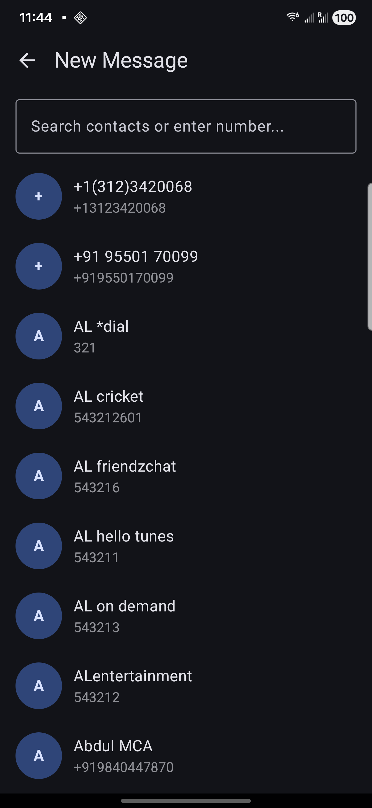
*Android settings and preferences*

| Category | Options |
|----------|---------|
| **Appearance** | Theme (Light/Dark/System), Font size |
| **Notifications** | Sounds, Vibration, LED, Per-contact sounds |
| **Privacy** | Blocked contacts, Read receipts |
| **Messages** | Delivery reports, Auto-download MMS |
| **Desktop Sync** | Manage paired devices, Sync options |
| **AI Assistant** | Enable/disable features |
| **About** | Version, Licenses |

### macOS Settings

Access: ⌘ + , or Menu → Settings

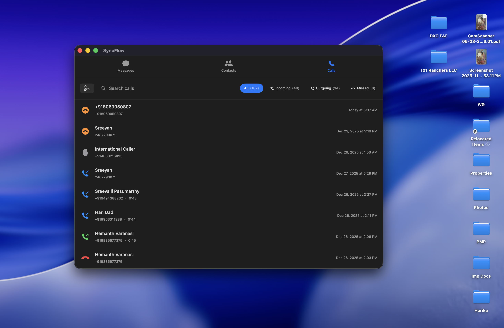
*macOS settings window*

| Category | Options |
|----------|---------|
| **General** | Launch at login, Menu bar icon |
| **Notifications** | Sounds, Badges, Banners |
| **Appearance** | Theme, Compact mode |
| **Shortcuts** | Customize keyboard shortcuts |
| **Privacy** | Blocked contacts |
| **Account** | Pairing status, Sign out |

### Notification Customization

#### Per-Contact Sounds (Android)
1. Open conversation
2. Tap contact name at top
3. Select **Notification Sound**
4. Choose a sound

#### Do Not Disturb
- Mute individual conversations
- Or use system DND mode

### Theme Options

| Theme | Description |
|-------|-------------|
| Light | White background, dark text |
| Dark | Dark background, light text |
| System | Follows device setting |

---

## Troubleshooting

### Messages Not Syncing

**Check:**
1. Internet connection on both devices
2. Pairing status (Settings → Desktop Sync)
3. Firebase connection (check for errors)

**Fix:**
1. Force close and reopen apps
2. Re-pair devices if needed
3. Check Firebase status

### Can't Send Messages

**Android:**
1. Ensure SyncFlow is set as default SMS app
2. Check SMS permissions
3. Verify cellular connection

**macOS/Web:**
1. Check pairing status
2. Ensure Android phone is online
3. Messages are sent through your phone

### Notifications Not Working

**Android:**
1. Settings → Apps → SyncFlow → Notifications → Enable
2. Check Do Not Disturb mode
3. Battery optimization may block notifications

**macOS:**
1. System Preferences → Notifications → SyncFlow → Allow
2. Check Focus/DND settings

### Call Quality Issues

1. Check internet connection (WiFi recommended)
2. Close other bandwidth-heavy apps
3. Move closer to router
4. Try disabling video for audio-only

### Pairing Failed

1. Ensure both devices on internet
2. Try manual code if QR fails
3. Check camera permissions for QR scan
4. Restart both apps and try again

### Battery Drain (Android)

SyncFlow uses background services for sync. To optimize:
1. Settings → Battery → Optimize (but allow for sync)
2. Reduce sync frequency if not needed real-time
3. Disable features you don't use

### App Crashes

1. Update to latest version
2. Clear app cache (Settings → Apps → SyncFlow → Clear Cache)
3. Restart device
4. Reinstall app if persistent

### Contact Support

If issues persist:
1. Check GitHub Issues for known problems
2. Report new issues with:
   - Device model and OS version
   - App version
   - Steps to reproduce
   - Error messages/screenshots

---

## Frequently Asked Questions

### General

**Q: Is SyncFlow free?**
A: Yes, SyncFlow is free for personal use.

**Q: Does SyncFlow work without internet?**
A: SMS/MMS on Android works offline. Sync to desktop requires internet.

**Q: Can I use SyncFlow on multiple computers?**
A: Yes, pair as many devices as needed.

### Privacy

**Q: Can others read my messages?**
A: No, messages are encrypted and only accessible by your paired devices.

**Q: Does SyncFlow store my messages on servers?**
A: Messages are stored encrypted on Firebase for sync. Only your devices can decrypt them.

**Q: What data does the AI Assistant access?**
A: The AI runs locally and only analyzes messages on your device. Nothing is sent to external servers.

### Technical

**Q: Why must SyncFlow be the default SMS app?**
A: Android requires this to send SMS/MMS messages.

**Q: Can I use SyncFlow with dual SIM?**
A: Yes, SyncFlow supports dual SIM. Select which SIM to send from in conversation settings.

**Q: Does SyncFlow support RCS?**
A: Not currently. RCS support depends on carrier integration.

---

## Tips & Tricks

### Power User Tips

1. **Quick OTP Copy**: Tap the copy button on OTP messages to copy code instantly

2. **Keyboard Shortcuts (macOS)**: Learn ⌘+N (new), ⌘+Enter (send), ⌘+F (search)

3. **Drag & Drop**: On macOS, drag files directly into conversations

4. **Smart Replies**: Use suggested replies for quick responses

5. **Pin Important Chats**: Pin frequently used conversations to top

6. **Schedule Messages**: Long-press Send to schedule for later

7. **Voice Messages**: Hold mic icon, speak, release to send

8. **AI Spending Queries**: Ask "Amazon spending this month" for merchant-specific analysis

9. **Archive vs Delete**: Archive hides but keeps messages; Delete removes permanently

10. **Menu Bar Quick Access**: Keep SyncFlow in menu bar for instant access

---

*For the latest updates and feature announcements, check the GitHub repository.*
